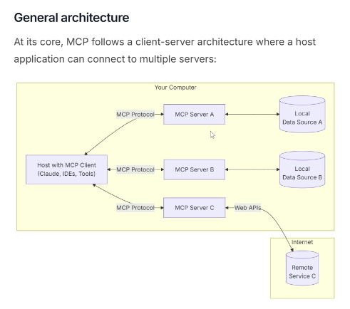

# Model-Context-Protocol

## What is MCP?
- MCP (Model Context Protocol) is an open protocol introduced by Anthropic.
- It standardizes how AI applications connect with external tools and data sources.
- MCP acts like a USB-C port for AI applications.

---

## Key Idea
- Instead of directly integrating tools using REST APIs, AI applications use MCP as a standard communication layer.
- This reduces dependency on changing third-party APIs.

---

## Traditional Approach (REST APIs)
- AI applications previously connected to:
  - Databases
  - Search tools
  - External APIs
  - Vector databases
  - Third-party services
- Communication happened through REST APIs.

### Problem with REST APIs
- Whenever third-party providers updated APIs or services:
  - Developers had to modify application code.
  - Maintenance became difficult.
  - Integration complexity increased.

---

## How MCP Solves the Problem
- MCP introduces a standardized protocol between:
  - AI Assistants / LLMs
  - External tools and services

- Service providers can update tools internally without affecting client applications.

- Developers only need to follow the MCP standard once.

---

## MCP in Generative AI & Agentic AI
MCP is highly useful in:
- Generative AI applications
- Agentic AI systems
- Multi-agent workflows
- LangChain integrations
- LangGraph workflows
- RAG pipelines
- Tool calling systems

---

## MCP Architecture
AI Assistant / LLM
        ↓
   MCP Protocol
        ↓
External Tools & Services

Examples:
- Wikipedia
- Search APIs
- RAG Databases
- Vector Databases
- External APIs

---

## Benefits of MCP
- Standardized integration
- Better scalability
- Easier maintenance
- Tool interoperability
- Reduced code changes
- Faster AI development

---

## Real-world Analogy
MCP is similar to a USB standard:
- Devices can change internally,
- But as long as they follow USB standards,
  they remain compatible.

Similarly:
- Tools can evolve internally,
- But AI applications continue working using MCP.

---

## Important Technologies Mentioned
- REST APIs
- FastAPI
- LangChain
- LangGraph
- Generative AI
- Agentic AI
- RAG Systems
- Tool Calling
- Multi-Agent Systems

---



## Summary
MCP provides a universal standard for connecting AI systems with tools and external services, making AI applications more scalable, maintainable, and future-proof.

# Model Context Protocol (MCP) Integration Summary

## Overview
This video explains how to integrate and use the **Model Context Protocol (MCP)** with tools like **Claude Desktop** and **Cursor IDE** using the **Smithery AI** platform.

---

# What is MCP?

Model Context Protocol (MCP) is a standard protocol that allows AI clients/hosts to communicate with external tools and services through MCP servers.

Examples of MCP-enabled hosts:
- Claude Desktop
- Cursor IDE
- VS Code

Examples of MCP servers:
- GitHub
- Slack
- Supabase
- DuckDuckGo Search
- Playwright
- Perplexity Search
- Redis

---

# Smithery AI Platform

Smithery AI acts as an aggregator marketplace for multiple MCP servers from different providers.

Features:
- Browse available MCP servers
- View tools/APIs exposed by servers
- Get JSON configurations
- Integrate MCP servers into AI hosts

---

# MCP Integration Workflow

## Step 1: Select MCP Server
Example:
- DuckDuckGo Search
- Exa Search
- GitHub MCP

---

## Step 2: Choose Client/Host
Supported hosts:
- Claude Desktop
- Cursor IDE
- VS Code

---

## Step 3: Copy JSON Configuration
Smithery AI generates configuration JSON automatically.

Example:
```json
{
  "exa": {
    "command": "cmd",
    "args": ["..."]
  }
}

